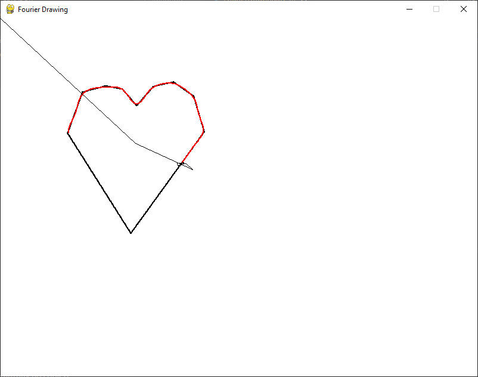

## Fourier Drawing
Implementation of Fourier Drawing (inspired by 3b1b video on it) written in Python and using Pygame.

### Requirements
```
pip install -r requirements.txt
```

### Usage
```
python FourierDrawing.py <FILENAME.svg> -n <Number of vectors to draw with>
```

Note that the file passed needs to be '.svg', and by default the number of vector is 61.

### Screenshot
